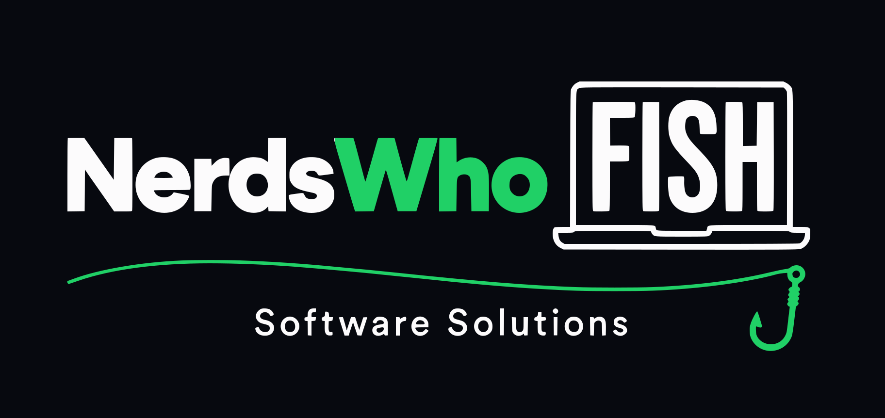

<!-- markdownlint-disable-file MD013 MD033 MD041 -->

  

  <strong>Small business software, built in Ohio.</strong> 
  Websites, infrastructure, and open source tools from a family-run team.

  <a href="https://www.nerdswhofish.com">Website</a>
  &nbsp;&middot;&nbsp;
  <a href="https://www.nerdswhofish.com/products/">Products</a>
  &nbsp;&middot;&nbsp;
  <a href="https://www.nerdswhofish.com/#contact">Work with us</a>

## Open source projects

We build the tools we wish existed, use them in real systems, and publish the useful ones. The result is opinionated software with clear documentation and the rough edges already found.

<table>
  <tr>
    <td width="50%" valign="top">
      <h3><a href="https://github.com/NerdsWhoFish/coop">Coop</a></h3>
      
Self-hosted, parent-curated YouTube for kids. Children get the familiar experience, while parents control which channels they can watch.

      
<code>Go</code> <code>Swift</code> <code>TypeScript</code>

    </td>
    <td width="50%" valign="top">
      <h3><a href="https://github.com/NerdsWhoFish/dusk">Dusk</a></h3>
      
A Git-backed developer platform that gives homelabbers and their agents one place to understand, remember, and safely operate the whole estate.

      
<code>Go</code> <code>SQLite</code> <code>OpenTelemetry</code>

    </td>
  </tr>
  <tr>
    <td width="50%" valign="top">
      <h3><a href="https://github.com/NerdsWhoFish/bookings">Bookings</a></h3>
      
A small, themeable Google Calendar scheduling service. It handles conflicts and double-booking without a permanent server or reminder machine.

      
<code>Go</code> <code>TypeScript</code> <code>Cloud Run</code>

    </td>
    <td width="50%" valign="top">
      <h3><a href="https://github.com/NerdsWhoFish/trailwire">Trailwire</a></h3>
      
A local coordination bus for AI coding agents working across Claude Code, Codex, and Cursor. It keeps parallel work from quietly colliding.

      
<code>Go</code> <code>MCP</code> <code>SQLite</code>

    </td>
  </tr>
</table>

## Need the nerds?

We build custom websites, APIs, automation, cloud infrastructure, and practical AI workflows for small businesses. We are local to central Ohio and work with businesses across the state.

  <a href="https://www.nerdswhofish.com/#contact"><strong>Tell us what is getting in your way</strong></a>

